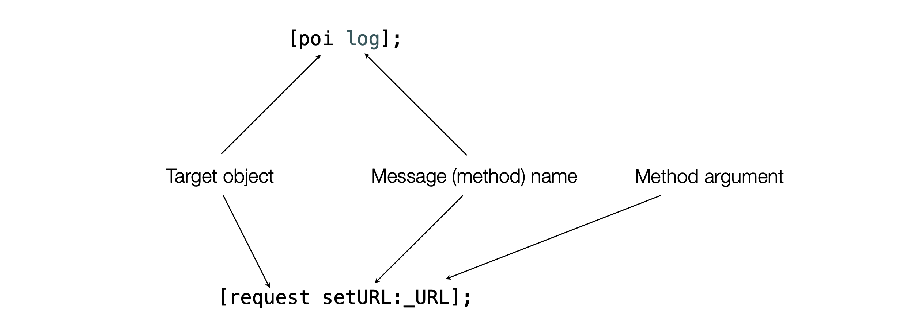

# iOS - Apple 
TODO: indice  
TODO: torna all'indice

object-c
OOP
    classi e oggetti
    tre principi
        polimorfismo
        ereditarietà
        incapsulamento
Objective-C programs
Objective-C methods

# Object-C
Objective-C è il linguaggio di programmazione principale che usiamo quando si scrive software per OS X e iOS.  
Objective-C è un superset rigoroso del linguaggio di programmazione C e fornisce funzionalità orientate agli oggetti e un runtime dinamico: 
- è possibile compilare qualsiasi programma C con il compilatore Objective-C 
- è possibile includere qualsiasi istruzione C all'interno di un programma Objective-C

Objective-C eredita la sintassi, i tipi primitivi e le istruzioni di controllo del flusso di C e aggiunge la sintassi per definire classi e metodi.  
Tutta la sintassi che non è correlata alle caratteristiche orientate agli oggetti del linguaggio è la stessa della sintassi classica C.

# Object-Oriented Programming
OOP è un paradigma di programmazione che mira a costruire programmi che sono:  
- Altamente modulare 
- Ben strutturato 
- Facile da mantenere 
- Facile da estendere  

OOP si concentra anche sulla riutilizzabilità del codice.

In OOP, un programma è composto da un insieme (graph) di oggetti interagenti, che rappresentano concetti relativi allo scenario specifico (domain). 

Un oggetto rappresenta una struttura dati che è composta dall'aggregazione di:
- Stato (state): i dati effettivi su cui l'oggetto opera (attributi) 
- Comportamento (behavior): Le funzionalità che permettono di operare con l'oggetto e i suoi dati (metodi)

Un oggetto può interagire con un altro invocando uno dei suoi metodi.  
Gli oggetti hanno responsabilità distinte e devono essere considerati come "black-box" indipendenti.  
OOP mira a scrivere programmi complessi facili da gestire, mantenere, testare ed eseguire il debug.

## Classi e oggetti
Le classi sono progetti (o prototipi) per gli oggetti.  
Gli oggetti sono istanze di una classe.  
Una classe definisce la struttura e il comportamento che tutte le istanze di quella classe condividono.  
Una classe deve essere specializzata per un determinato scopo: deve fare poche cose, bisogna garantire la modularità.

## I tre principi di OOP
Per essere efficace, OOP definisce 3 principi di base che devono essere seguiti: 
- Ereditarietà
- Incapsulamento 
- Polimorfismo 

### Ereditarietà
L'ereditarietà consente di definire nuove funzionalità di una classe estendendola. 

La classe che viene estesa è chiamata superclasse.  
Il processo di estensione di una classe è chiamato sottoclassificazione (sottoclasse).  
Una classe eredita tutte le variabili e i metodi definiti nella sua superclasse. 

Tutte le classi definiscono quindi una gerarchia che alla fine definisce quali funzionalità hanno le istanze di ogni classe.  
L'ereditarietà crea una relazione semantica "è-un".  
Tutto ciò che una superclasse può fare, le sue sottoclassi possono fare.

### Incapsulamento
Incapsulamento significa che gli attributi e i metodi per operare sui dati sono confezionati nello stesso componente (una classe).  

Secondo i principi di incapsulamento, solo l'interfaccia (cioè i metodi per operare sui dati) dovrebbe essere accessibile e visibile dall'esterno di un oggetto, mentre l'implementazione (cioè i dettagli di come viene eseguita la manipolazione) dovrebbe essere nascosta.  

L'incapsulamento permette di trattare gli oggetti come black-box, che forniscono alcune funzionalità ma nascondono i dettagli delle loro operazioni.  
Diversi livelli di visibilità possono essere definiti mediante metodi di marcatura come `private`, `protected` o `public`.

### Polimorfismo
Con l'ereditarietà, tutte le sottoclassi ereditano gli stessi metodi della loro superclasse.  
È possibile che le sottoclassi sovrascrivino i metodi delle loro superclassi. 

Poiché possiamo sempre trattare un oggetto come un membro di una delle sue superclassi, il comportamento effettivo che eseguirà quando uno dei suoi metodi viene invocato dipenderà dal suo tipo concreto.  

La capacità di adattare il comportamento al tipo concreto è chiamata polimorfismo.  

# Objective-C programs
I programmi Objective-C sono suddivisi in due tipi principali di file:
- `.h` file: definiscono le interfacce, cioè quali funzionalità sono esposte ad altre parti del codice; classi, strutture dati e metodi sono definiti nel file di interfaccia.
- `.m` file: implementare le interfacce definite nel file .h corrispondente.

Nel caso in cui un file di implementazione contenga codice C++, deve essere nominato utilizzando l'estensione `.mm`.

## Definizioni classi
Le classi sono definite nel file dell'interfaccia, tra la direttiva @interface e il corrispondente `@end`.  
Tutto all'interno del blocco di interfaccia definisce la struttura della classe (variabili di istanza) e le funzionalità.  

Definiamo una nuova classe chiamata MDPoi, usata per contenere un punto di interesse, con nome, latitudine e longitudine. 

```objectivec
// Siamo nel file .h

// Importare l'header per la classe NSObject 
#import <Foundation/Foundation.h> 

// Dichiariamo la classe MDPoi e estendiamo la classe NSObject
@interface MDPoi : NSObject {       
    // Le variabili di istanza devono essere dichiarate tra parentesi graffe
    NSString *_name;
    double _latitude;
    double _longitude;
}

// I metodi devono essere definiti al di fuori delle parentesi graffe
(void)setLatitude:(double)lat;

@end
```

## Implementazioni classi
Ora, implementiamo la classe MDPoi definita nel file di interfaccia `MDPoi.h`.

```objectivec
// Siamo nel file .m

// Importare il file di intestazione dell'interfaccia
#import "MDPoi.h"

// L'implementazione dell'interfaccia deve essere tra la 
// direttiva @implementation e la corrispondente @end
@implementation MDPoi

    // I metodi dichiarati devono essere implementati
    (void)setLatitude:(double)lat{
        _latitude = lat;
    }
@end
```

## Special keywords: id, nil, BOOL and self
In Objective-C, tutti gli oggetti sono allocati nell'heap, quindi per accedervi usiamo sempre un puntatore all'oggetto.
- `id`: indica un puntatore a un oggetto di qualsiasi tipo (simile a `void*` in C);
- `nil`: è il valore di un puntatore che punta a niente (`NULL` in C);
- `BOOL`: è il tipo definito (typedef nel file objc.h) da Objective-C per i valori booleani. [ YES == 1 (true), NO == 0 (false) ];
- `self`: è un puntatore all'oggetto corrente (simile a `this` in Java).

# Objective-C methods
Gli oggetti Objective-C parlano tra loro inviando messaggi.  
L'invocazione del metodo si basa sul passaggio di messaggi agli oggetti.  

Il passaggio del messaggio differisce dalle chiamate di metodo classiche perché il metodo da eseguire non è legato a una sezione specifica del codice (nella maggior parte dei casi in fase di compilazione) ma la destinazione del messaggio viene risolta dinamicamente in fase di esecuzione, quindi potrebbe accadere che il destinatario non risponda a quel messaggio (nessun controllo del tipo può essere eseguito in fase di compilazione).  

Se il destinatario di un messaggio non risponde al messaggio, viene generata un'eccezione.  
È possibile inviare un messaggio a `nil: no NullPointerException is thrown` (0 is returned).

## Inviare messaggi
Le parentesi quadre vengono utilizzate per inviare messaggi.


## Sintassi

```objectivec
- (NSArray *)pointsWithinRange:(double)distance fromPoi:(MDPoi *)poi;
```
- I metodi di istanza (rispetto al particolare oggetto che è la destinazione del messaggio) iniziano con un segno meno. Possono accedere alle variabili di istanza
- I metodi di classe (relativi alla classe stessa) iniziano con un segno più. Accessibili attraverso il nome della classe (non è necessaria un'istanza) non possono accedere alle variabili di istanza i metodi di utilità e i metodi di allocazione sono in genere metodi di classe.
- Tipo di ritorno (tra parentesi)
- Il nome di questo metodo è `pointsWithinRange:fromPoi:`
- `(double)distance` e `(MDPoi *)poi` sono i due tipi.

I nomi dei metodi in Objective-C suonano come frasi linguaggio naturale: `pointsWithinRange:fromPoi:`.  
Qualche metodo può avere un nome molto lungo: per mantenere il codice leggibile, è meglio allineare le colonne