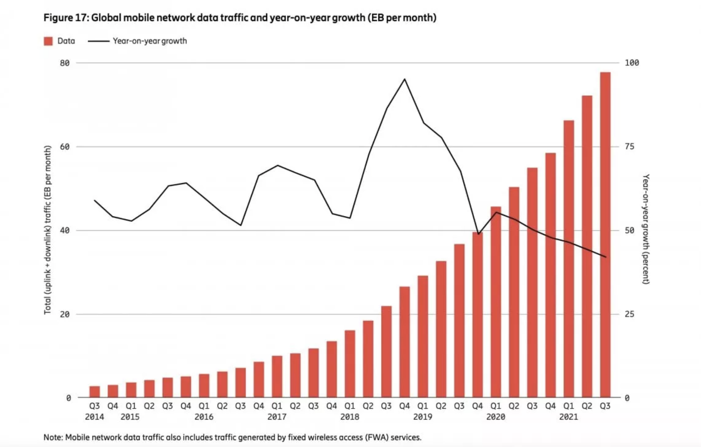

# Mobile Computing
Il Mobile Computing è una forma di interazione uomo-computer attraverso la quale un computer dovrebbe essere trasportato durante il normale utilizzo.  

Il Mobile Computing ha tre aspetti: 
- Comunicazione mobile: affronta i problemi di comunicazione nelle reti ad hoc e infrastrutturali, nonché le proprietà di comunicazione, i protocolli, i formati di dati e le tecnologie concrete. 
- Hardware mobile: relativo all'hardware, ad esempio dispositivi mobili o componenti dei dispositivi. 
- Software mobile: si occupa delle caratteristiche e dei requisiti delle applicazioni mobili.

Dal 2007 ad oggi l'utilizzo di dispositivi mobili ha avuto una crescita esponenziale.

Ogni anno nel periodo natalizio si ha una crescita del mercato dei dispositivi mobili.
